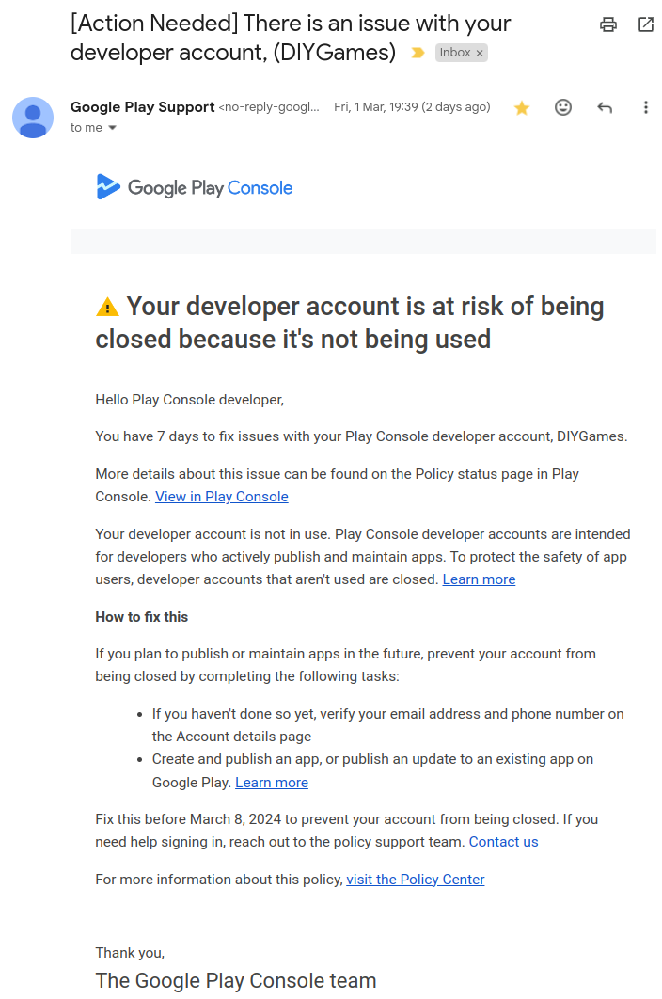

# Interactive-Horror-Story

About ten years ago, I registered an Android developer account, with the aspiration to make my own app empire. I wrote and published two apps, that were taken down over the years.

My Android developer account hasn't been used in a long time. Till an unfortunate letter hit my doorstep.



Oh nooz. Guess I'll have to make an app. And fast.

This repo is my pathetic attempt at creating something that would potentially be allowed into the Play Store and keep my account alive. I paid 25 bucks for that!

## Why an interactive horror story?

About a year ago, I was playing around with Flutter to create a platform for AI generated visual novels. I made quite a lot of progress, but never finished it.

The horror story is the first story that I generated in the platform. For this pathetic excuse for an app, I'll just repackage the horror story part into a separate app.

## Why an open source repo?

Because, really, this project is long abandoned. At this point, I'm happy to let anyone salvage what they can from it :)

## Running

Install the Flutter toolchain, then:
```
flutter packages get
flutter run -d web
```

A browser window should open and you can play the game.

## Releasing for Android
To make a `.aab`:
```
flutter build appbundle
```

To make a `.apk`:
```
flutter build apk --release
```
